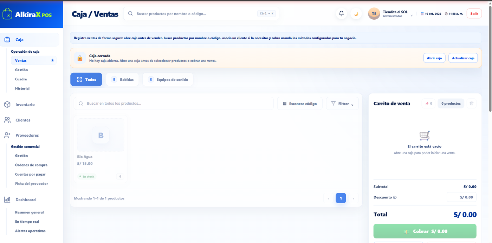
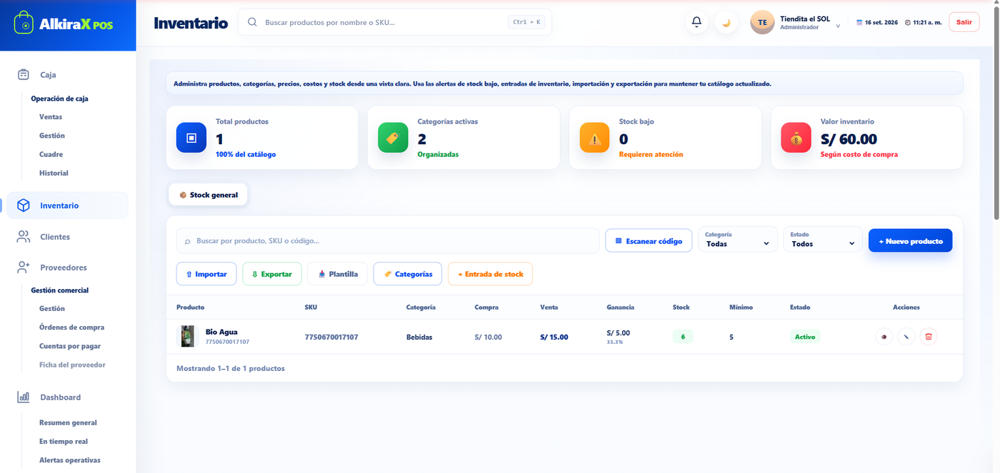
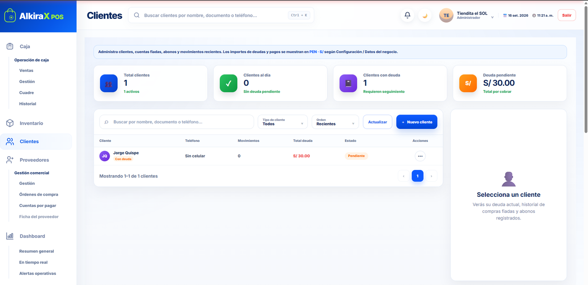
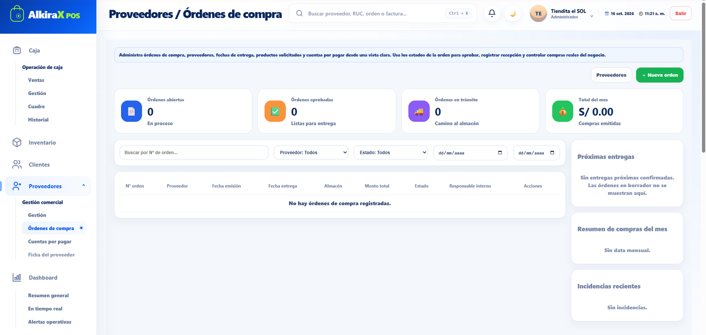
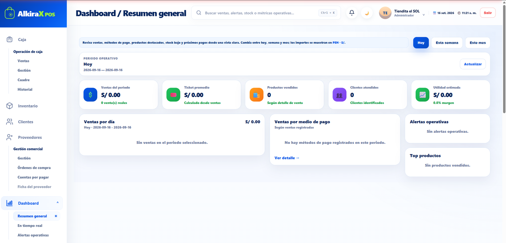
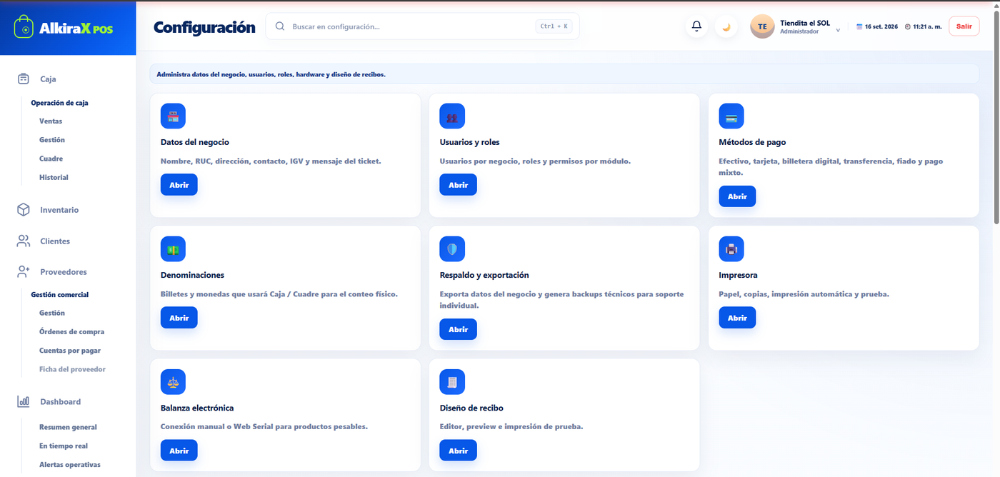
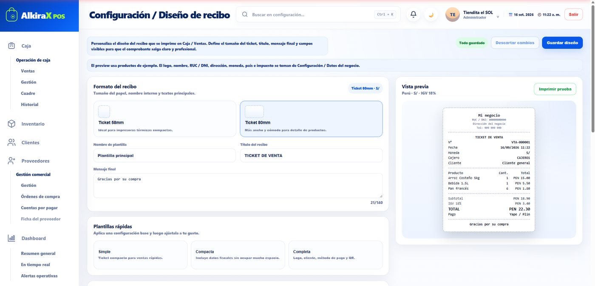
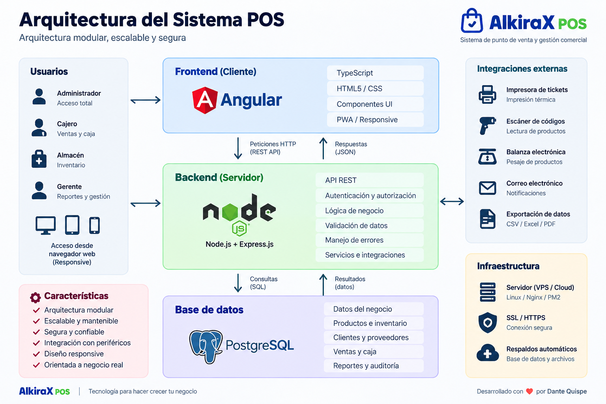

# 🛒 Sistema POS

### Sistema de punto de venta y gestión comercial


Sistema POS desarrollado para gestionar las operaciones principales de un negocio, integrando ventas, caja, inventario, clientes, proveedores, compras, reportes y configuración desde una aplicación web.

> 🔒 **Código fuente privado:** este repositorio es la presentación pública del proyecto. La implementación completa se mantiene en repositorios privados.

---

## 📸 Vista general

Aplicación web orientada a la gestión diaria de un negocio, con módulos para operaciones de caja, ventas, inventario, clientes, proveedores, reportes y configuración.



---

## 🚀 Funcionalidades principales

### 💰 Caja y ventas

- Apertura y cierre de caja.
- Registro de ventas.
- Carrito de venta.
- Búsqueda de productos por nombre, SKU o código.
- Asociación de clientes a las ventas.
- Aplicación de descuentos.
- Control del efectivo de caja.
- Métodos de pago configurables.
- Historial de operaciones.
- Cuadre de caja.
- Impresión de tickets.

### 📦 Inventario

- Gestión de productos.
- Gestión de categorías.
- Control de stock.
- Precios de compra y venta.
- Cálculo de margen.
- Control de stock mínimo.
- Alertas de stock bajo.
- Entradas de inventario.
- Importación y exportación de productos.
- Escaneo de códigos.

### 👥 Clientes

- Registro y consulta de clientes.
- Control de cuentas pendientes.
- Registro de ventas fiadas.
- Gestión de abonos.
- Historial de movimientos.
- Seguimiento de deuda pendiente.

### 🚚 Proveedores y órdenes de compra

- Gestión de proveedores.
- Registro de órdenes de compra.
- Estados de las órdenes.
- Fechas de emisión y entrega.
- Productos solicitados.
- Gestión de cuentas por pagar.
- Seguimiento de compras.

### 📊 Dashboard y reportes

- Resumen general del negocio.
- Ventas por periodo.
- Ticket promedio.
- Productos vendidos.
- Clientes atendidos.
- Utilidad estimada.
- Ventas por medio de pago.
- Productos con ventas.
- Reportes de ventas por producto.
- Exportación de información a CSV.

### ⚙️ Configuración

- Datos del negocio.
- Usuarios y roles.
- Permisos por módulo.
- Métodos de pago.
- Denominaciones de efectivo.
- Configuración de impresora.
- Diseño y formato del recibo.
- Respaldo y exportación.
- Configuración de balanza electrónica.

---

## 🖥️ Capturas de pantalla

### 💰 Caja / Ventas

Pantalla principal para registrar ventas, buscar productos, gestionar el carrito y realizar el cobro.


### 📦 Inventario

Gestión de productos, categorías, precios, costos y stock.



### 👥 Clientes

Administración de clientes, movimientos y cuentas pendientes.



### 🚚 Proveedores y órdenes de compra

Gestión de proveedores y seguimiento de órdenes de compra.



### 📊 Dashboard

Panel de información para consultar ventas, productos, clientes, utilidad y métricas operativas.



### ⚙️ Configuración

Configuración general del negocio, usuarios, roles, métodos de pago, impresora y otros parámetros del sistema.



### 🧾 Diseño de recibo

Personalización del formato del ticket y vista previa antes de la impresión.



---

## 🏗️ Arquitectura

El sistema utiliza una arquitectura Full Stack separando la interfaz de usuario, la API y la persistencia de datos.



### Flujo principal

```text
Usuario
   │
   ▼
┌──────────────────────┐
│ Frontend - Angular   │
│ TypeScript / UI      │
└──────────┬───────────┘
           │ HTTP / REST
           ▼
┌──────────────────────┐
│ Backend - Node.js    │
│ Express.js / API     │
│ Lógica de negocio    │
└──────────┬───────────┘
           │ SQL
           ▼
┌──────────────────────┐
│ PostgreSQL           │
│ Datos del sistema    │
└──────────────────────┘

       │
       ├── Impresora térmica
       ├── Escáner de códigos
       └── Balanza electrónica
```

---

## 🧩 Módulos del sistema

```text
Sistema POS
│
├── Caja
│   ├── Ventas
│   ├── Gestión de caja
│   ├── Cuadre
│   └── Historial
│
├── Inventario
│   ├── Productos
│   ├── Categorías
│   ├── Stock
│   ├── Entradas
│   └── Importación / Exportación
│
├── Clientes
│   ├── Clientes
│   ├── Cuentas pendientes
│   ├── Abonos
│   └── Historial
│
├── Proveedores
│   ├── Proveedores
│   ├── Órdenes de compra
│   └── Cuentas por pagar
│
├── Dashboard
│   ├── Resumen general
│   └── Reportes
│
└── Configuración
    ├── Datos del negocio
    ├── Usuarios y roles
    ├── Métodos de pago
    ├── Impresora
    ├── Balanza electrónica
    ├── Respaldo y exportación
    └── Diseño de recibo
```

---

## 🛠️ Tecnologías

### Frontend

- Angular 19
- TypeScript
- HTML5
- CSS
- Diseño responsive

### Backend

- Node.js
- Express.js
- API REST
- Autenticación y autorización
- Arquitectura modular

### Base de datos

- PostgreSQL
- SQL
- Persistencia de información
- Relaciones entre entidades

### Herramientas e integraciones

- Git
- Impresión de tickets
- Escáner de códigos
- Balanza electrónica
- Exportación de información
- Generación de comprobantes

---

## 🔐 Seguridad

El sistema contempla mecanismos de autenticación, autorización y control de acceso para proteger las operaciones.

- Autenticación de usuarios.
- Roles y permisos.
- Control de acceso por módulo.
- Protección de operaciones sensibles.
- Validación de datos.
- Manejo centralizado de errores.
- Variables de entorno para configuraciones sensibles.

> Las credenciales, claves, contraseñas, configuraciones privadas y datos reales no forman parte de este repositorio público.

---

## 🌐 Demo

👉 **[AlkiraX POS](https://pos.alkirax.com/)**

Aplicación web para visualizar la interfaz, los módulos principales y el flujo general del sistema POS.

---

## 🔒 Código fuente

La implementación completa se mantiene privada.

Componentes principales:

- `sistema-pos-frontend`
- `sistema-pos-backend`
- Base de datos y configuraciones del sistema
- Integraciones con periféricos POS

Este repositorio público contiene documentación, arquitectura, capturas de pantalla y material demostrativo.

---

## 🎯 Objetivos del proyecto

- Desarrollar una solución Full Stack orientada a procesos reales de negocio.
- Diseñar e implementar APIs REST.
- Trabajar con una base de datos relacional.
- Implementar autenticación y autorización.
- Gestionar operaciones de caja e inventario.
- Integrar dispositivos y periféricos utilizados en un entorno POS.
- Construir dashboards y reportes.
- Diseñar una interfaz orientada a la operación diaria.
- Aplicar separación de responsabilidades y organización modular.

---

## 📌 Estado del proyecto

**MVP funcional — en desarrollo continuo.**

El proyecto continúa evolucionando mediante nuevas funcionalidades, mejoras de experiencia de usuario, integraciones y optimizaciones técnicas.

---

## 👨‍💻 Autor

### Dante Quispe

**Software Developer | Backend / Full Stack Junior**

Tecnologías principales:

`Node.js` · `Angular` · `PostgreSQL` · `SQL` · `C#` · `.NET` · `REST API` · `Python` · `Git`

---

## 🔗 Enlaces

- 💻 GitHub: [devbydante](https://github.com/devbydante)

---

> 🛒 **Sistema POS** — Proyecto personal de desarrollo de software.
